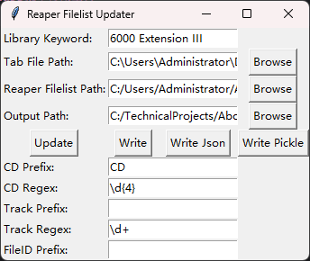
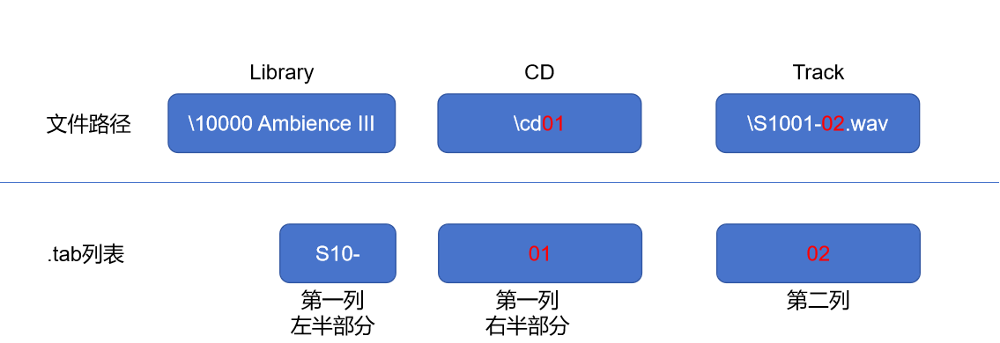

# Reaper MediaDB批量修改工具

## 主要功能

* 解析ReaperFileList
* 读取[BaseHead Injector](https://br0wsers.com/detail/product/Xzl610bqwo9m9s0pgaio5Fl1u-5043-11882.html)自带 .tab 表格文件
* 将 .tab 表格写入ReaperFileList

## 使用方法

> 该仓库仍在Alpha阶段，推荐有编程经验以及正则表达式知识之后再来使用

1. Clone 仓库；
2. 运行`pip install -r requirements.txt`
3. 运行`main.py`
4. 选取各项参数，点击Update查看匹配情况
5. 点击**Write Json**或**Write Pickle**保存当前匹配进度
6. 点击**Write**输出一个新的ReaperFileList

## 对于各个参数的说明

假如你的音效路径如下：

> W:\\02.Sound.Ideas.Sound.Effects\\01.General SFX 1K-S13\\10000 Ambience III\\cd01\\S1001-02.wav

在`Sound Ideas Series 10,000 Ambience III Sound Effects Library.tab`表格文件中，对应如下一行：

> S10-01  *02*  01  *AUSTRALIA, JUNGLE      AUSTRALIA: FITZROY ISLAND TROPICAL FOREST: EVENING AMBIENCE: HEAVY INSECTS, FROGS, WIND THROUGH TREES, FOREIGN*  3:00

这一行第一列`S10-01`对应的是“Series 10000”的缩写`S10`和CD序号`01`，第二列对应的是文件的序号`02`，那我们需要让程序明白`S10-01 02`与`\cd01\S1001-02.wav`之间的关系，如此便有了界面上的一些文本框。

### \Library\CD\Track

对于上述音效文件路径，我们规定以反斜线为分隔符，倒数第三部分为`Library`(10000 Ambience III)，接下来是`CD`(cd01)，最后是`Track`（S1001-02.wav）。

那么稍加思考我们可以得出以下关系：

第一部分的对应关系因库而异，故而匹配时需要手动输入`Library Key`，也就是文件路径的倒数第三级（10000 Ambience III），以及.tab的`CD Prefix`，也就是第一列左半部分；

第二部分只需要提取`CD`中的数字部分便可以与.tab相应行对应。将这条规则写作正则表达式，便是`CD Regex`；

第三部分只需要提取`Track`在“S1001-”和“.wav”前的两位数字即可对应。将这两条规则写作正则表达式便是`Track Prefix`和`Track Regex`。

