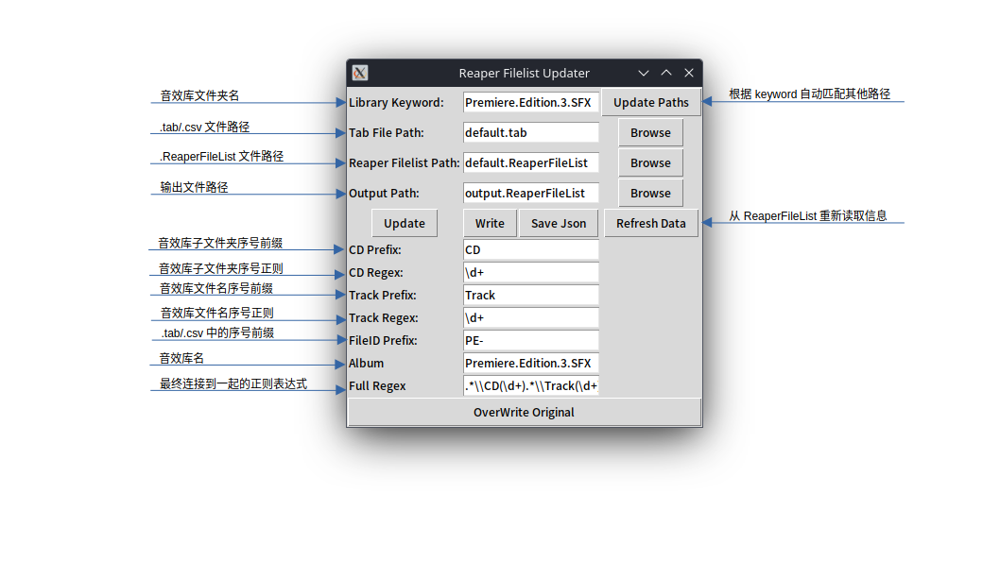

# MediaDB Parser: Reaper MediaDB批量解析修改工具

MediaDB指代的是Reaper的音效管理窗口Media Explore的数据库文件（.ReaperFileList)，MediaDB Parser是一个简单的.ReaperFileList文件解析器，可以实现以下功能：

* 将.ReaperFileList解析为Python词典
* 完成类似soundminer的批量处理音效信息的功能
    * 从[BaseHead Injector](https://br0wsers.com/detail/product/Xzl610bqwo9m9s0pgaio5Fl1u-5043-11882.html)的.tab文件读取信息，转换为.ReaperFileList条目
    * 从指定结构的.csv文件读取信息，转换为.ReaperFileList条目

## 安装以及使用方式

> 该项目仍在Alpha阶段，推荐有编程经验以及正则表达式知识之后再来使用

1. Clone 仓库；
2. 运行`pip install -r requirements.txt`
3. 运行`main.py`
4. 选取各个路径，调整各项参数，点击Update查看匹配情况
5. 点击**Write**将当前进度输出为**Output Path**对应的.ReaperFileList文件以保存当前进度
6. 点击下方**OverWrite Original**覆盖原始.ReaperFileList文件

## 界面说明

## 文件匹配方式说明

假如在`xx.ReaperFileList`，你的某一条音效路径如下：

> W:\\02.Sound.Ideas.Sound.Effects\\01.General SFX 1K-S13\\10000 Ambience III\\cd01\\S1001-02.wav

在`yy.tab`表格文件中，对应如下一行：

> S10-01  *02*  01  *AUSTRALIA, JUNGLE      AUSTRALIA: FITZROY ISLAND TROPICAL FOREST: EVENING AMBIENCE: HEAVY INSECTS, FROGS, WIND THROUGH TREES, FOREIGN*  3:00

这一行第一列`S10-01`对应的是“Series 10000”的缩写`S10`和CD序号`01`，第二列对应的是文件的序号`02`，那我们需要让程序明白`S10-01 02`与`\cd01\S1001-02.wav`之间的关系。

对于上述音效文件路径，我们规定以反斜线为分隔符，倒数第三部分为`Library`(10000 Ambience III)，接下来是`CD`(cd01)，最后是`Track`（S1001-02.wav）。

那么我们可以得出以下关系：

第一部分的对应关系因库而异，故而匹配时需要手动输入`Library Key`，也就是文件路径的倒数第三级（10000 Ambience III），以及.tab的`CD Prefix`，也就是第一列左半部分；

第二部分只需要提取`CD`中的数字部分便可以与.tab相应行对应。将这条规则写作正则表达式，便是`CD Regex`；

第三部分只需要提取`Track`在“S1001-”和“.wav”前的两位数字即可对应。将这两条规则写作正则表达式便是`Track Prefix`和`Track Regex`。

所有规则按照一定方式拼接到一起，便是`Full Regex`。这条正则表达式将在按下`Update`之后完成匹配路径、提取CD序号、提取Track序号的任务，mediadb_parser将在之后找到tab文件中对应的条目，完成文件匹配。

## 开发相关
本项目尚不完善，在实际使用中可能会遇到很多当前UI无法解决的问题。开发者可参考以下文档对代码做修改，以适应不同情况。

[开发说明](docs/development.md)
